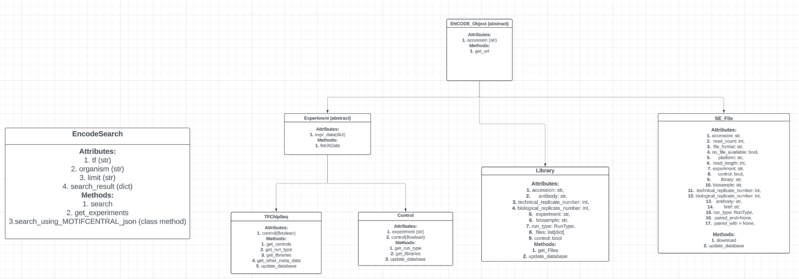
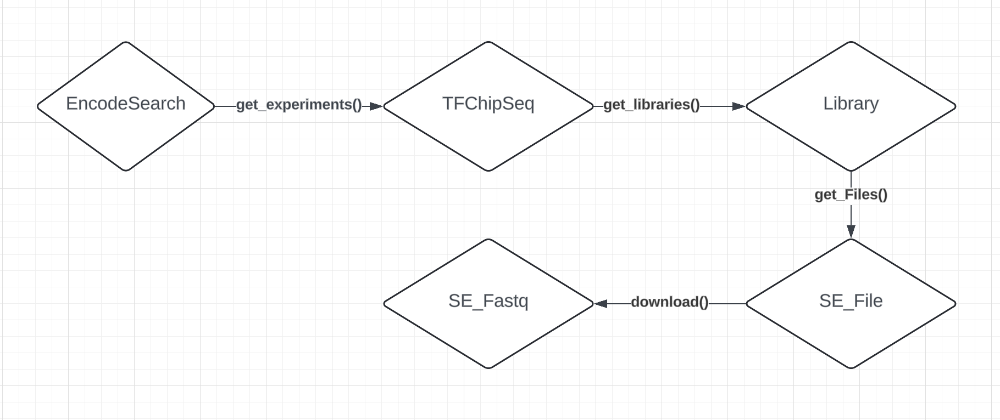

# Selex-X-Genome

## Data sourced using

`curl -o data/motifcentral.json https://motifcentral-resources.s3.us-west-2.amazonaws.com/MotifCentral.v1.0.0.json
`
The json contain all the motifs available at motifcentral.

## To run

1. Activate the conda environment in the environment.yml file.
2. You need to install the seqtk and add it to your path.

## The Basics

We have three packages that comprise most of this project. They can be found at ./source

1. ENCODE: Classes to represent different types of ENCODE entities. Forexample:             Experiment, Library, Files, SearchResults, etc.

2. diskfiles: Classes to represent different types of bioinformatic file types. For example: Fasta, Fastq and Count Tables.

3. motifs: Classes to represent different types of motifs. For example: mononucleotide      PSAM, dinucleotide PSAM, co-operative PSAM, etc. Currently, only the mononucleotide PSAM has been implemented.

## ENCODE

The primary purpose of this package is to:
1. Search the ENCODE DB for experiments

2. Automatically download raw fastq files for all the experiments returned by the search.

## Typical Workflow

